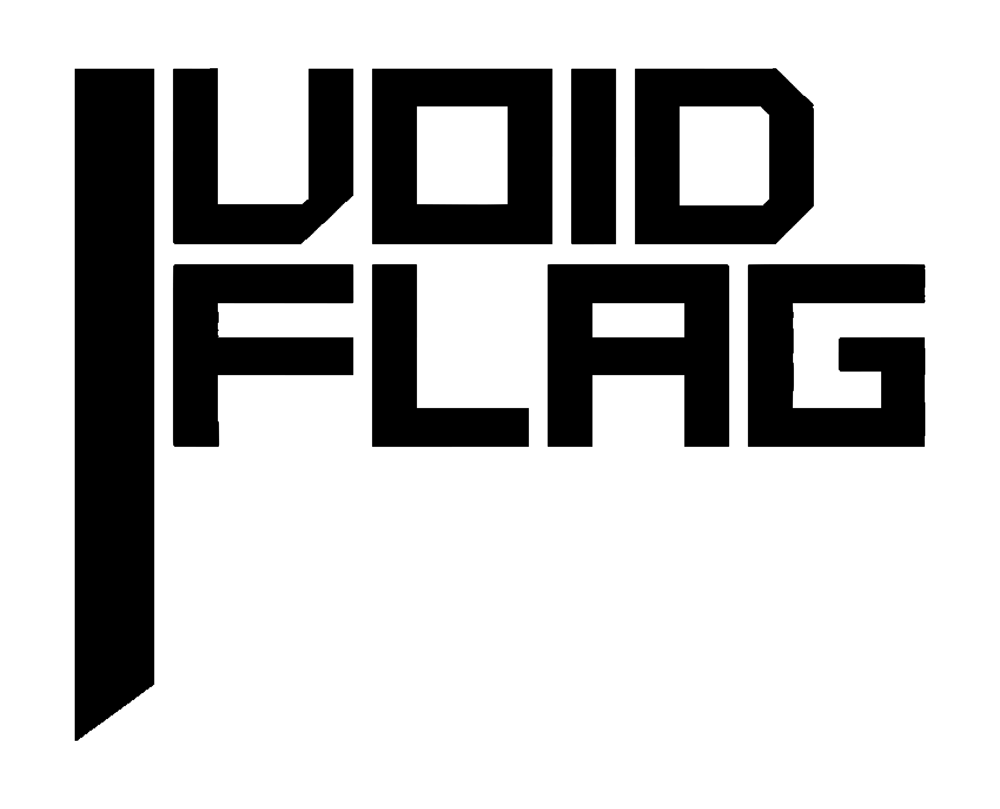

# VoidFlag — `.vf` Language Support

> Schema-first feature flags with a first-class editor experience.



## Features

### Syntax Highlighting

Full syntax highlighting for `.vf` schema files — keywords, types, values, strings, numbers, booleans, and comments all colored correctly.

```vf
// Feature flags for my app
flag darkMode {
  type bool
  fallback false
}

flag theme {
  type string
  fallback "light"
}

flag fontSize {
  type number
  fallback 16
}
```

### Real-time Diagnostics

Errors are underlined as you type — no need to run anything.

- Type mismatches (`type bool` with a string fallback)
- Unknown fields inside a flag block
- Duplicate flag names
- Single quotes instead of double quotes
- Missing `type` or `fallback` fields
- Malformed values

### IntelliSense

Context-aware completions that only suggest what makes sense where your cursor is.

- `flag` at the top level
- `type` and `fallback` inside a flag block — only the ones you haven't written yet
- `bool`, `string`, `number` after `type`
- `true`, `false` after `fallback` on a boolean flag

### Hover Documentation

Hover over any keyword to see what it does.

### Auto-formatting

Format your schema with `Shift+Alt+F` (or **Format Document**). The formatter is opinionated — one canonical style, no config needed.

**Before:**

```vf
flag   darkMode{type   bool
  fallback       false}
    flag theme{type string
fallback "light"}
```

**After:**

```vf
flag darkMode {
  type bool
  fallback false
}

flag theme {
  type string
  fallback "light"
}
```

Formatting is skipped if the file has errors — fix them first.

### Auto-closing Pairs

- `{` → `{}`
- `"` → `""`

### Comment Toggling

- `Ctrl+/` — toggle line comment (`//`)
- `Shift+Alt+A` — toggle block comment (`/* */`)

---

## The `.vf` Schema Format

A `.vf` file is a list of flag declarations. Each flag has a name, a type, and a fallback value.

```vf
flag <name> {
  type <bool | string | number>
  fallback <value>
}
```

**Types and their fallback values:**

| Type     | Fallback example  |
| -------- | ----------------- |
| `bool`   | `true` or `false` |
| `string` | `"hello"`         |
| `number` | `16` or `3.14`    |

**Comments:**

```vf
// This is a line comment

/* This is a
   block comment */
```

---

## Usage with the VoidFlag CLI

This extension pairs with the `voidflag` CLI. Once you've written your schema:

```bash
# Initialize a project
vf init

# Generate TypeScript output from schema.vf
vf generate src --lang ts
```

This produces a fully typed `VoidClient` setup ready to use in your app.

---

## Requirements

- VSCode `^1.82.0`

---

## Extension Settings

No configuration required.

---

## Known Issues

- Diagnostics show one error at a time (the parser stops at the first error)
- No support for multi-root workspaces yet

---

## Release Notes

### 0.0.1

Initial release.

- Syntax highlighting
- Real-time diagnostics
- Context-aware IntelliSense
- Hover documentation
- Auto-formatting
- Auto-closing pairs
- Comment toggling

---

## Contributing

Issues and PRs welcome at [github.com/C1ANCYSz/voidflag-vscode](https://github.com/your-org/voidflag).

---
